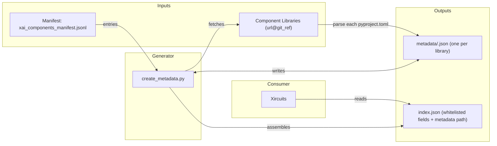

# xai-components-manifest

A centralized repository for managing metadata of Xircuits remote component libraries. This manifest enables Xircuits to dynamically discover, configure, and install remote component libraries without requiring a full release of Xircuits.

---

## How it Works



---

## Repository Structure

```
├── xai_components_manifest.jsonl   # JSONL manifest of all remote component libraries
├── create_metadata.py             # Script to generate per-library metadata
├── index.json                     # Auto-generated; lists all metadata files
└── metadata/                      # Auto-generated; one JSON file per library
    ├── xai_pycaret.json
    ├── xai_modelstash.json
    └── ...
```

---

## Prerequisites

- Python 3.9+
- `git` installed and on your `PATH`
- Python packages (install via `pip`):

  ```bash
  pip install toml
  ```

---

## 1. Adding a New Component Library

Add a new entry to the manifest file `xai_components_manifest.jsonl`. You can do this via the command line or a text editor.

### Command Line Example

```bash
echo '{"path": "xai_components/xai_twilio", "url": "https://github.com/XpressAI/xai-twilio", "library_id": "TWILIO", "git_ref": "main"}' \
  >> xai_components_manifest.jsonl
```

### Text Editor Example

Open `xai_components_manifest.jsonl` in your preferred editor and append a new line:

```jsonl
{"path": "xai_components/xai_twilio", "url": "https://github.com/XpressAI/xai-twilio", "library_id": "TWILIO", "git_ref": "main"}
```

---

## 2. Generating Metadata

Run the `create_metadata.py` script. This will:

1. Clone each repository listed in `xai_components_manifest.jsonl`.
2. Extract relevant fields from each library’s `pyproject.toml` (from `[project]`).
3. Fill missing values with defaults (`null` or empty lists).
4. Produce an `index.json` and a `metadata/` folder containing one JSON file per library.

```bash
python create_metadata.py
```

---

## 3. Outputs (Metadata → Index)

### `metadata/<library_id>.json`

**Contains:**

* **Manifest data:** `path`, `url`, `library_id`, `git_ref`
* **Project data** (`[project]`): `version`, `description`, `authors`, `license`, `readme`, `repository`, `keywords`, `requirements`

### `index.json`

**Fields:**
`library_id`, `name`, `path`, `local_path`, `status`, `version`, `description`, `authors`, `license`, `readme`, `repository`, `keywords`, `requirements`, `url`, `git_ref`, `default_example_path`, `metadata`

**Notes:**

* Values come from the manifest when present, otherwise from `pyproject.toml` `[project]`.
* Missing strings → `null`; missing lists → `[]`.
* `metadata` points to `metadata/<library_id>.json`.

**Example:**

```json
{
  "library_id": "TWILIO",
  "name": "xai-twilio",
  "path": "xai_components/xai_twilio",
  "local_path": null,
  "status": null,
  "version": "0.1.0",
  "description": "A Xircuits component library for Twilio services!",
  "authors": [{ "name": "XpressAI", "email": "eduardo@xpress.ai" }],
  "license": "MIT",
  "readme": "README.md",
  "repository": "https://github.com/XpressAI/xai-twilio",
  "keywords": ["xircuits", "twilio", "sms", "whatsapp", "voice"],
  "requirements": ["twilio==9.4.5"],
  "url": "https://github.com/XpressAI/xai-twilio",
  "git_ref": "main",
  "default_example_path": null,
  "metadata": "metadata/twilio.json"
}
```

---

## 4. Integration into Xircuits

Xircuits fetches `index.json` at startup to locate each library’s metadata. It uses this information to clone and install remote component libraries as needed.

Keep this manifest up to date whenever adding, removing, or updating a remote component library.

---

## Future Work

* Add CI checks to ensure `index.json` and `metadata/` files are in sync.
* Implement a static site generator to render library metadata automatically.
* Support versioning or tagging beyond a simple `git_ref`.

---
